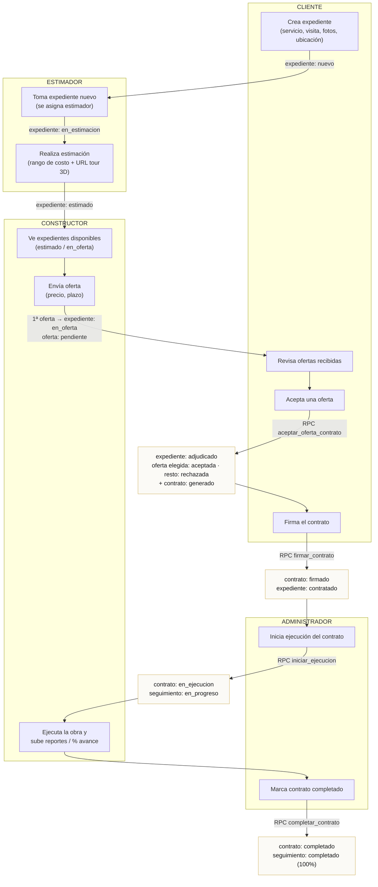
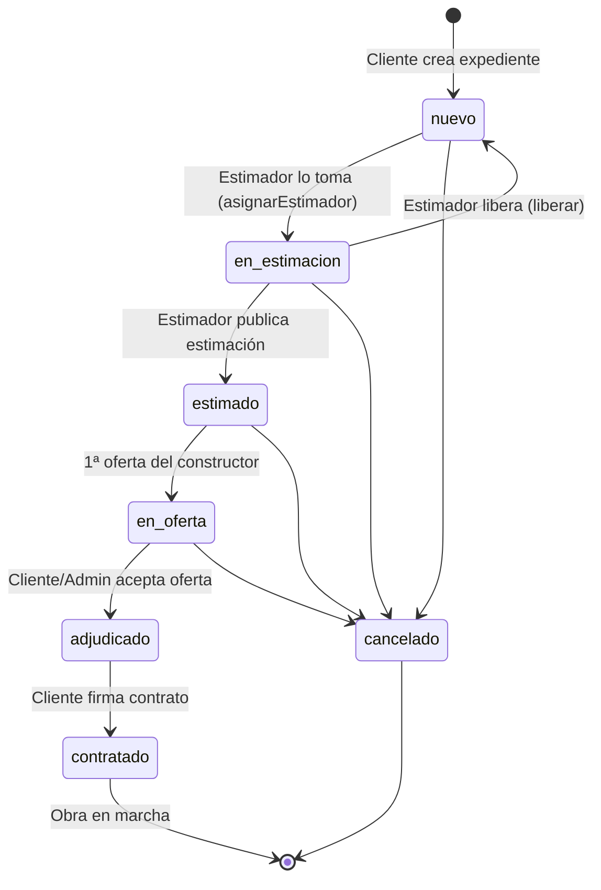
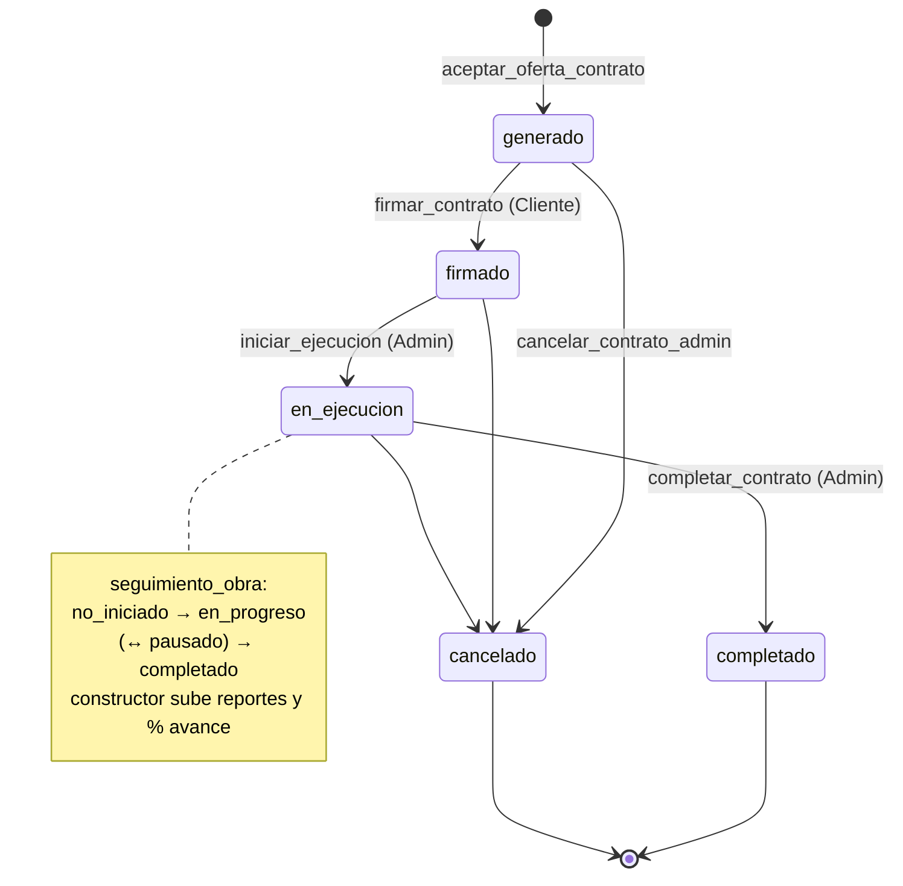

# Flujo del proceso — de la creación del expediente a la obra completada

> Diagramas derivados del código real: estados de los enums (`estado_expediente`,
> `estado_oferta`, `estado_contrato`, `estado_seguimiento`) y las RPCs/servicios
> que los transicionan. Fuentes: `src/app/data/*`, `src/app/services/*`,
> `supabase/migrations/*`.

## Actores

| Rol | Responsabilidad principal |
|-----|---------------------------|
| **Cliente** | Crea el expediente, recibe ofertas, acepta una y firma el contrato. |
| **Estimador** | Toma expedientes nuevos, los estima (costo + tour 3D). |
| **Constructor** | Ve expedientes estimados y envía ofertas; ejecuta y reporta la obra. |
| **Administrador** | Supervisa todo; puede adjudicar, iniciar ejecución y completar contratos. |

---

## 1. Flujo extremo a extremo

---

## 2. Ciclo de vida del **expediente**

---

## 3. Ciclo de vida del **contrato** (y seguimiento de obra)

---

## Resumen de transiciones (estado ↔ disparador)

| # | Acción (actor) | Mecanismo | Expediente | Oferta | Contrato | Seguimiento |
|---|----------------|-----------|------------|--------|----------|-------------|
| 1 | Crear expediente (Cliente) | `expediente.insert` | → `nuevo` | — | — | — |
| 2 | Tomar para estimar (Estimador) | `asignarEstimador` | → `en_estimacion` | — | — | — |
| 3 | Publicar estimación (Estimador) | `updateEstado` | → `estimado` | — | — | — |
| 4 | Enviar oferta (Constructor) | `oferta.insert` + `updateEstadoExpedienteEnOferta` | → `en_oferta` | `pendiente` | — | — |
| 5 | Aceptar oferta (Cliente/Admin) | RPC `aceptar_oferta_contrato` | → `adjudicado` | elegida `aceptada`, resto `rechazada` | crea `generado` | — |
| 6 | Firmar contrato (Cliente) | RPC `firmar_contrato` | → `contratado` | — | → `firmado` | — |
| 7 | Iniciar ejecución (Admin) | RPC `iniciar_ejecucion_contrato` | — | — | → `en_ejecucion` | → `en_progreso` |
| 8 | Reportar avance (Constructor) | `seguimiento` updates | — | — | — | `en_progreso`/`pausado` |
| 9 | Completar (Admin) | RPC `completar_contrato` | — | — | → `completado` | → `completado` (100%) |
| — | Cancelar | RPC / update | `cancelado` | — | `cancelado` | — |
